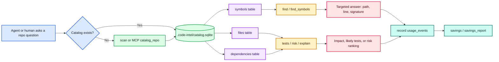
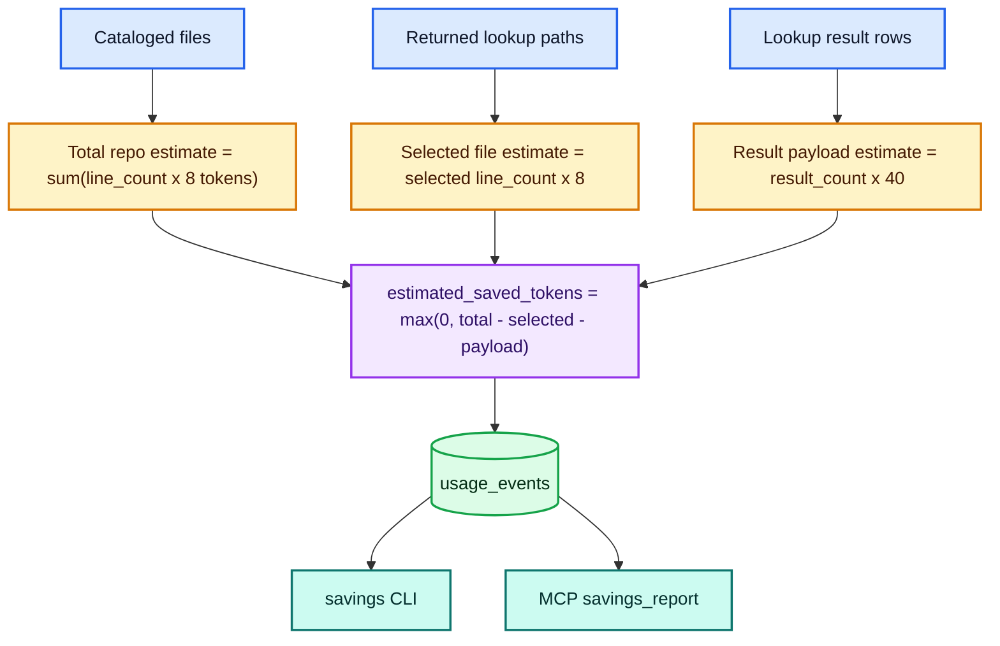
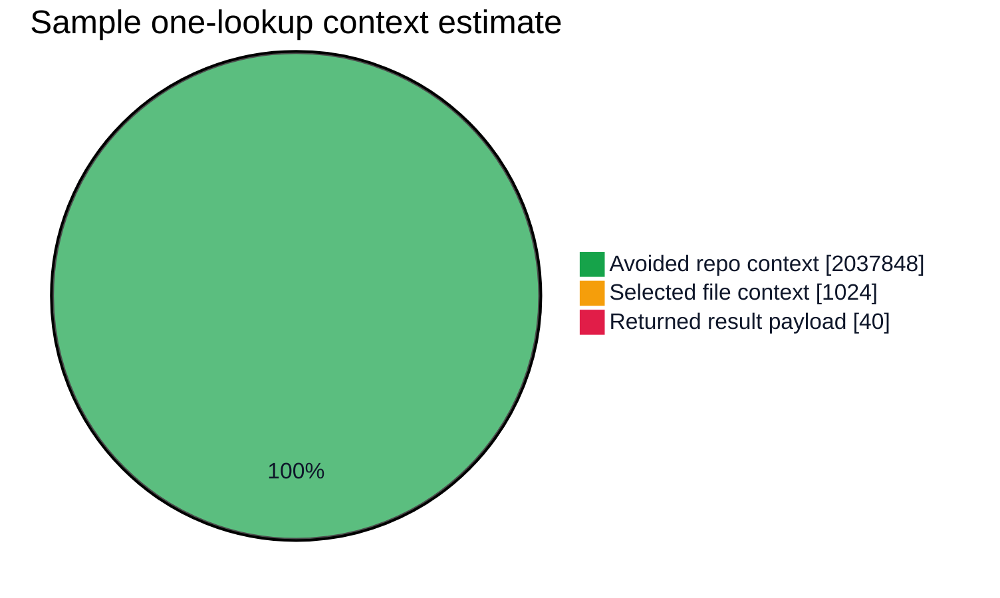

# code-intel

```text
   ______          __        ____      __       __
  / ____/___  ____/ /__     /  _/___  / /____  / /
 / /   / __ \/ __  / _ \    / // __ \/ __/ _ \/ /
/ /___/ /_/ / /_/ /  __/  _/ // / / / /_/  __/ /
\____/\____/\__,_/\___/  /___/_/ /_/\__/\___/_/
```

<p align="center">
  <strong>Self-contained repository intelligence for faster AI-assisted code changes.</strong>
</p>

<p align="center">
  <a href="https://github.com/marlonfcaraujo/code-intel/actions/workflows/ci.yml"></a>
  
  
  
  
  
  
  <a href="CONTRIBUTING.md"></a>
  <a href="SUPPORT.md"></a>
  <a href="ROADMAP.md"></a>
</p>

## TL;DR

`code-intel` is a local map of a codebase for coding agents and engineers. It
scans a repository into SQLite, indexes files, symbols, and dependencies, then
answers targeted questions with ranked results and bounded source snippets.
That helps agents read less context and shows how much context a lookup likely
avoided.

How it works: `scan` builds or refreshes `.code-intel/catalog.sqlite`; commands
query that local catalog for lookup, references, tests, risk, and context; the
optional MCP server exposes the same capabilities to compatible agents. No
hosted service or background daemon is required.

```bash
uv run code-intel scan /path/to/repo
uv run code-intel savings --repo /path/to/repo
```

`code-intel` builds a local SQLite catalog for a repository, then answers the
questions coding agents usually waste time and tokens trying to discover by
scanning files.

It is designed for large codebases where Codex, Claude Code, or a human engineer
needs quick answers before editing:

- where a function, class, method, constant, or type lives
- which files depend on a file
- which tests are likely related to a change
- which files have the highest blast-radius risk
- how much context the targeted lookup likely avoided loading

Normal use is self-contained. `code-intel` creates and reads its own local
catalog at `.code-intel/catalog.sqlite`. It does not require jCodemunch, a hosted
service, or a background daemon.

## Why code-intel

`code-intel` is built for the part of coding-agent work where most time and
tokens disappear: repo orientation, symbol lookup, cross-repo backend/UI context,
and deciding which files are worth reading.

| Compared with | What code-intel adds |
| --- | --- |
| `grep` / `ripgrep` | Structured symbols, file ranking, exact references, dependency impact, likely tests, and bounded snippets instead of raw text matches |
| direct file reads | `outline`, `context-pack`, and `workspace-context` let agents inspect the smallest useful source ranges first |
| stale local indexes | explicit health, scan, and benchmark commands show freshness, file counts, symbol counts, and provider coverage before trusting results |
| jCodemunch day to day | local SQLite catalogs, backend+UI workspaces, source-first lookup, UI label/CSS/string search, MCP tools, token-savings telemetry, and repeatable provider benchmarks |
| hosted code search | no external service, no daemon requirement, and per-repo catalogs that stay beside the source tree |

The goal is not to beat every tool on every single raw query. A warmed `grep`
can be faster for one string, and a stale one-file index can look fast because it
has almost nothing to search. The goal is better agent behavior: fresher coverage,
source-ranked results, bounded context payloads, and evidence about what the
agent avoided loading.

## Installation

### Prerequisites

- Python 3.12+
- [`uv`](https://github.com/astral-sh/uv)
- Git

### Run from a source checkout

Use this during development or before publishing the package:

```bash
cd /path/to/code-intel
uv sync --group dev
uv run code-intel --help
```

When operating on another repository from this checkout, pass `--project` so the
command works from any current directory:

```bash
uv run --project /path/to/code-intel code-intel scan /path/to/repo
```

This is the safest way while developing the tool locally.

### Install as a local tool

Install the CLI from a local checkout when you want `code-intel` available on
your shell path:

```bash
uv tool install /path/to/code-intel
code-intel --help
```

Reinstall after local changes:

```bash
uv tool install --force /path/to/code-intel
```

### Install as a local command

Use this when you want one stable command available from any shell:

```bash
uv tool install /path/to/code-intel
code-intel --version
```

Run this once per checkout after updates:

```bash
code-intel --help
```

### Install MCP support

MCP support is optional:

```bash
cd /path/to/code-intel
uv sync --extra mcp --group dev
```

### Updating an existing installation

After pulling the desired branch in your code-intel checkout:

```bash
uv sync --extra mcp --group dev --frozen
uv run code-intel upgrade-config --dry-run
uv run code-intel upgrade-config
uv run code-intel --version
```

Configuration upgrades retain user values and unknown fields, add missing
defaults, and back up changed files. Existing catalogs and usage history stay
local. Reinstall separately installed CLI tools and restart active MCP connections
to load the updated package. See [Upgrading](docs/UPGRADING.md) for catalog
migrations, rollback and managed repository instructions.

## Quickstart

### 1) Catalog any repository

```bash
code-intel scan /path/to/repo
code-intel workspace-scan --workspace backend-ui --incremental --skip-unchanged-meta --json
```

### 2) Search for symbols and references

```bash
code-intel lookup --repo /path/to/repo get_database_url
code-intel find --repo /path/to/repo get_database_url
code-intel search-text --repo /path/to/repo "API_BASE_URL"
code-intel references --repo /path/to/repo get_database_url
code-intel tree --repo /path/to/repo
code-intel repo-outline --repo /path/to/repo
code-intel workspace-outline --workspace backend-ui
```

### 3) Check impact before editing a file

```bash
code-intel explain --repo /path/to/repo src/app/service.py
code-intel tests --repo /path/to/repo src/app/service.py
code-intel risk --repo /path/to/repo --top 20
```

### 4) Show usage and estimated savings

```bash
code-intel savings --repo /path/to/repo
```

## Open Source Contributor Docs

- [Contributing](CONTRIBUTING.md): setup and contribution expectations
- [Code of Conduct](CODE_OF_CONDUCT.md): community standards
- [Security policy](SECURITY.md): how to report vulnerabilities
- [Support](SUPPORT.md): how to get help and where to ask questions
- [Issue templates](.github/ISSUE_TEMPLATE): structured bug reports and feature requests
- [Roadmap](ROADMAP.md): current and upcoming priorities

If you want project visibility in one place, the README includes:

- Install and MCP setup
- Search and analysis workflows
- Safety and output expectations
- Contribution and community links

## What It Creates

Running `scan` creates this local file inside the target repository:

```text
<repo>/.code-intel/catalog.sqlite
```

The SQLite catalog contains:

| Table | Purpose |
| --- | --- |
| `meta` | repo path, generated time, file count |
| `files` | discovered source files, language, line count, byte size |
| `symbols` | names, kinds, paths, line numbers, signatures, docs |
| `dependencies` | import edges with code, standard-library, external package, asset, or unresolved category |
| `text_index` | FTS5 trigram index for fast source text matching |
| `text_lines` | indexed line table for fast snippets and context |
| `usage_events` | lookup events used for savings reports |

The catalog is generated data. Keep it out of commits.

### Secret Handling

code-intel does not try to become a full secret-scanning product, but it avoids
turning obvious secrets into searchable agent context:

- discovery skips common secret-bearing paths such as `.env*`, `.npmrc`,
  `.pypirc`, `.netrc`, private-key files, keystores, and `.ssh`/`.aws`/`.kube`
  directories
- indexed text lines redact common provider tokens, bearer tokens, private-key
  blocks, and generic `SECRET`/`TOKEN`/`PASSWORD`/`API_KEY` assignments
- source snippets, `content`, `context-pack`, and MCP context responses use the
  same redaction marker: `[REDACTED_SECRET]`

This is a safety layer for agent context, not a substitute for tools such as
GitHub secret scanning or dedicated pre-commit secret detection.

For a project-local ignore without changing tracked files:

```bash
printf '\n.code-intel/\n' >> /path/to/repo/.git/info/exclude
```

For a shared project ignore:

```bash
echo ".code-intel/" >> /path/to/repo/.gitignore
```

## Commands

### `scan`

Build or refresh the catalog.

```bash
code-intel scan [REPO]
code-intel scan /path/to/repo
code-intel scan /path/to/repo --incremental
code-intel scan /path/to/repo --workers 1
code-intel scan /path/to/repo --incremental --json
code-intel scan /path/to/repo --incremental --skip-unchanged-meta --json
```

If the database does not exist, `scan` creates `.code-intel/` and
`catalog.sqlite`. If it already exists, `scan` rebuilds it from the current
source tree.

Use `--incremental` for scheduled refreshes. When source paths are unchanged,
code-intel reuses unchanged file analyses and reparses only changed files. When
files are added or removed, it applies a partial update and reparses dependency
sources that may be affected by changed path resolution. Catalog metadata also
includes an analyzer version; when the indexer learns a new language or symbol
rule, the next incremental scan rebuilds once instead of preserving stale
analysis. Incremental writes are scoped to changed, removed, dependency-affected,
or metadata-touched paths, and the source-text index is updated for only those
affected rows.
For frequent background jobs, add `--skip-unchanged-meta` to avoid the
metadata-only SQLite write when no files changed; normal incremental scans keep
updating metadata timestamps by default.

File analysis uses an adaptive worker count by default: smaller repositories
stay serial to avoid thread overhead, while larger repositories use bounded
parallel workers. Use `--workers 1` for serial profiling or a fixed worker count
for benchmarking.

Use `--json` when scan output will be consumed by a scheduler or benchmark. The
payload includes reused, changed, and removed file counts, indexed text-line
count, written file count, analysis worker count, and phase timings for
discovery, change detection, analysis, and catalog writes.

### `install-refresh-job`

Install a macOS `launchd` job that keeps one or more catalogs warm with
incremental scans.

```bash
code-intel install-refresh-job /path/to/repo /path/to/repo/ui/src \
  --interval-minutes 180
```

For a saved backend+UI workspace, use the workspace name instead of repeating
paths:

```bash
code-intel install-refresh-job --workspace backend-ui --interval-minutes 180
```

When running from this source checkout, generate the job with `uv` so launchd can
find the development copy:

```bash
uv run code-intel install-refresh-job \
  --workspace backend-ui \
  --project /path/to/code-intel \
  --interval-minutes 180 \
  --label com.code-intel.refresh.dev
```

The command writes a runner under `$HOME/.code-intel/launchd/` and a plist under
`$HOME/Library/LaunchAgents/` on macOS. Load it with:

```bash
launchctl load $HOME/Library/LaunchAgents/com.code-intel.refresh.dev.plist
launchctl start com.code-intel.refresh.dev
```

Use `--dry-run` to inspect the paths without writing files.
Generated refresh jobs use
`workspace-scan --incremental --skip-unchanged-meta --json` so all selected
repositories refresh in one process with structured timing output while avoiding
metadata-only writes on no-change runs.

Nested worktree directories such as `.worktree/`, `.worktrees/`, and hidden
agent worktree folders are excluded when scanning a parent repository. If you
run `scan` with a worktree path as the repository root, that worktree is
cataloged normally and gets its own `.code-intel/catalog.sqlite`.

### `find`

Find cataloged symbols without scanning the whole repo.

```bash
code-intel find --repo /path/to/repo SymbolName
code-intel find --repo /path/to/repo SymbolName --limit 5
```

Default provider is the built-in `catalog` provider. If the catalog is missing,
`find` exits with a clear message telling you to run `scan` first.

Optional compatibility provider:

```bash
code-intel find --repo /path/to/repo SymbolName --provider jcodemunch
```

The `jcodemunch` provider only reads an existing local jCodemunch SQLite
database when explicitly requested. It is not required for normal operation.

You can switch the default symbol provider at runtime without changing commands:

```bash
export CODE_INTEL_DEFAULT_SYMBOL_PROVIDER=jcodemunch
```

When unset, the default remains `catalog`.

### `lookup`

Search symbols, file paths, and source text together when you do not know
whether a query is a function/class name, file stem, UI label, CSS class,
config key, or string fragment.

```bash
code-intel lookup --repo /path/to/repo PrimaryPanel
code-intel lookup --repo /path/to/repo PrimaryPanel --source-first
code-intel lookup --repo /path/to/repo "API_BASE_URL" --limit 10
code-intel lookup --repo /path/to/repo "empty state copy" --json
```

Results are ranked with exact/prefix symbol matches first, followed by bounded
file-path matches and source text snippets. Exact symbol or file-stem matches
keep the default text side small so definition lookups do not fan out into every
call site. Use `--text-limit 0` when the query is already a known symbol or file
and usage lines are not needed; use a larger `--text-limit` when you explicitly
want broader usage context.
Use `--source-first` for the common implementation-first agent path; it tries
symbol and file hits first, excludes tests, backfills from a wider candidate
window so test files do not waste result slots, and only falls back to bounded
source text when source/file lookup is empty. Pass `--text-limit 0` explicitly
with `--source-first` when text fallback should stay disabled.
Multi-word labels are also tried as bounded identifier/path variants, so a UI
label like `Incoming Items` can resolve source-first to `IncomingItems*`
symbols or `incoming-items` paths before text fallback.
Use this as the default agent entry point before loading files.

### `workspace-lookup`

Search several warm catalogs at once, useful when a task may cross backend and
UI repositories.

```bash
code-intel workspace-lookup \
  --repo /path/to/connector-service \
  --repo /path/to/backend-ui-app \
  capacitySummary
code-intel workspace-lookup --repo /path/backend --repo /path/ui/src PrimaryPanel --source-first --json
code-intel workspace-lookup --workspace backend-ui SERVICE_CONFIGS --source-first --json
```

Results are repo-qualified (`[connector-service]`, `[ui/src]`, etc.) and use the
same symbol/file/text ranking as `lookup`.

### `context-pack` and `workspace-context`

Turn ranked lookup hits into bounded source snippets, so agents can inspect the
most relevant code without reading full files.

```bash
code-intel context-pack --repo /path/to/repo SERVICE_CONFIGS --max-files 2
code-intel context-pack --repo /path/to/repo SERVICE_CONFIGS --text-limit 0 --max-files 1
code-intel workspace-context --workspace backend-ui capacitySummary --max-files 2 --max-lines-per-file 30
code-intel workspace-context --workspace backend-ui SERVICE_CONFIGS --source-first
code-intel workspace-context --workspace backend-ui PrimaryPanel --json
```

The output includes ranked hit metadata plus line-numbered snippets capped by
`--max-files` and `--max-lines-per-file`. Use `--source-first` when the agent
needs source implementation context first; it tries symbol/file matches before
text, excludes tests, and falls back to bounded text only when no source/file
hits exist. Use `related_tests` or `tests` when test context is the next step.
MCP `context_pack` and `workspace_context` responses default to a compact JSON
shape: nested hits and snippets use `repo_index` into the top-level
`repo_paths` list instead of repeating absolute repository paths, and omit
rank-only or derivable fields that remain available in full CLI JSON. They also
omit ranked hit rows by default; pass `include_hits=true` when the agent needs
lookup-hit metadata in addition to source snippets. MCP `workspace_context_many`
accepts several related workspace queries in one call, reuses the same catalog
stores, and returns one top-level repository map for the whole batch. It also
auto-selects a shared top-level snippet table when that is smaller than repeating
snippets under each query; pass `shared_snippets=false` to keep nested snippets.
Exact repeated batch queries, including case-only variants, are built once and
reused for each query row; the payload reports `unique_query_count` and
`reused_query_count`.

### `workspace-save`, `workspace-list`, and `workspace-scan`

Save repeated backend/UI repo sets once, then use the workspace name for lookup,
benchmarking, and scheduled refreshes.

```bash
code-intel workspace-save backend-ui \
  --repo /path/to/connector-service \
  --repo /path/to/backend-ui-app
code-intel workspace-list
code-intel workspace-scan --workspace backend-ui --incremental --skip-unchanged-meta --json
code-intel workspace-lookup --workspace backend-ui capacitySummary
code-intel workspace-benchmark --workspace backend-ui --query PrimaryPanel --query SERVICE_CONFIGS
code-intel workflow-benchmark --workspace backend-ui --query PrimaryPanel --query SERVICE_CONFIGS
```

Workspace files are JSON under `$HOME/.code-intel/workspaces/` by default.
`workspace-scan` refreshes all selected repositories in one Python process,
can scan independent repositories concurrently with `--repo-workers`, and accepts
`--skip-unchanged-meta` for frequent no-change refreshes.

### `search-text`

Search indexed source text without loading broad file context.

```bash
code-intel search-text --repo /path/to/repo "API_BASE_URL"
code-intel search-text --repo /path/to/repo "panel-fade" --context 0 --limit 10
code-intel search-text --repo /path/to/repo "empty state copy" --json
```

The text index is line-based and uses SQLite FTS5 trigram matching, so it works
for identifiers, UI labels, CSS classes, and string fragments. Results include
`path:line`, the matching line, and optional nearby context.

### `references` and `workspace-references`

Find exact source references for an identifier or text fragment without broad
grep output or full file reads.

```bash
code-intel references --repo /path/to/repo Service
code-intel references --repo /path/to/repo Service --no-definitions --context 0
code-intel workspace-references --workspace backend-ui PrimaryPanel --json
code-intel workspace-outline --workspace backend-ui --json
code-intel workspace-references --workspace backend-ui PrimaryPanel --summary-only --json
```

For identifier-shaped queries, the reference filter is boundary-aware, so
`Service` does not match `ServiceExtra`. Results classify definition lines
separately from non-definition references and return bounded snippets for each
match. Use `--summary-only` for high-fanout identifiers when you only need a
compact per-file map before choosing which files to inspect.

### `tree`, `repo-outline`, and `workspace-outline`

Inspect repository structure from the warm catalog instead of walking the
filesystem or reading top-level files.

```bash
code-intel tree --repo /path/to/repo --max-depth 3
code-intel tree --repo /path/to/repo --prefix src/app --json
code-intel repo-outline --repo /path/to/repo --top-files 20 --json
code-intel workspace-outline --workspace backend-ui --top-files 10 --json
```

`tree` returns directory/file entries with line and symbol counts. `repo-outline`
returns language totals, directory summaries, and symbol-heavy files for fast
orientation in large repositories. `workspace-outline` combines those summaries
across backend/UI workspaces in one call.

### `explain`

Show the likely impact of changing a file.

```bash
code-intel explain --repo /path/to/repo src/app/service.py
code-intel explain --repo /path/to/repo src/app/service.py --json
```

The report includes direct dependents, transitive dependents, related tests, a
blast score, and a risk label.

### `tests`

Find tests likely related to a source file.

```bash
code-intel tests --repo /path/to/repo src/app/service.py
```

Signals include matching file names, imports, and public source symbols
mentioned in test files.

### `outline`

Show symbols declared by a cataloged file before reading full source.

```bash
code-intel outline --repo /path/to/repo src/app/service.py
code-intel outline --repo /path/to/repo src/app/service.py --json
```

Use this to inspect classes, functions, methods, signatures, and line ranges
with a much smaller context payload than a full file read.

### `content`

Read a bounded slice from a cataloged file.

```bash
code-intel content --repo /path/to/repo src/app/service.py --start-line 20 --end-line 80
code-intel content --repo /path/to/repo src/app/service.py --json
```

Use this after `find`, `outline`, or `explain` identifies the exact source
range needed for the coding task.

### `risk`

Rank source files by blast-radius risk.

```bash
code-intel risk --repo /path/to/repo --top 20
```

Use this before broad refactors or when deciding where extra test coverage
matters most.

### `benchmark`

Compare real symbol lookup behavior across providers, or benchmark the built-in
text and unified lookup workflows agents use day to day.

```bash
code-intel benchmark --repo /path/to/repo \
  --query Service --query create_user \
  --provider catalog --provider jcodemunch \
  --mode symbol --repeat 9 --warmup 3
code-intel benchmark --repo /path/to/repo --query PrimaryPanel --mode lookup
code-intel benchmark --repo /path/to/repo --query panel-fade --mode text --json
code-intel benchmark --repo /path/to/repo --query Service --provider catalog --provider jcodemunch --json --summary
```

The report includes provider health, lookup latency, result counts, selected
files, source/test path counts, first-result classification, overlap where
multiple providers are comparable, and estimated avoided context. `jcodemunch`
comparison is available for `symbol` mode; `text` and `lookup` benchmark the
code-intel catalog workflow directly. Use `--summary` with `--json` when agents
only need timings, result counts, saved-token estimates, top paths, quality
signals, and overlap scores.

Benchmark provider order is configurable with:

```bash
export CODE_INTEL_BENCHMARK_PROVIDERS=catalog,jcodemunch
```

### `workspace-benchmark`

Measure unified lookup across several warm catalogs, including backend and UI
source trees.

```bash
code-intel workspace-benchmark \
  --repo /path/to/connector-service \
  --repo /path/to/backend-ui-app \
  --query capacitySummary \
  --query PrimaryPanel \
  --query SERVICE_CONFIGS
code-intel workspace-benchmark --workspace backend-ui --query PrimaryPanel --json --summary
```

The report includes per-catalog health, query latency, selected files, and
aggregate estimated avoided context for the whole workspace lookup.

### `workflow-benchmark`

Measure the full agent context-gathering workflow: lookup plus bounded source
snippets from `context-pack` or `workspace-context`.

```bash
code-intel workflow-benchmark \
  --workspace backend-ui \
  --query PrimaryPanel \
  --query SERVICE_CONFIGS \
  --source-first \
  --repeat 9 \
  --warmup 3 \
  --json --summary
code-intel workflow-benchmark --workspace backend-ui --query SERVICE_CONFIGS --source-first --max-files 1
```

The report includes query latency, context payload bytes, selected files,
selected source lines, returned-token estimates, source/test path counts,
first-result classification, and estimated avoided context. Use it when tuning
agent workflows because it measures the useful end state: how quickly the agent
can get enough source context without broad file reads.

### `benchmark-suite-save`, `benchmark-suite-list`, and `benchmark-suite-run`

Save a repeatable benchmark suite so real-world provider and workflow checks can
be rerun after each indexing or ranking change.

```bash
code-intel benchmark-suite-save backend-ui \
  --workspace backend-ui \
  --symbol-repo /path/to/connector-service \
  --symbol-query SERVICE_CONFIGS \
  --symbol-query create_record \
  --workflow-query SERVICE_CONFIGS \
  --workflow-query "Hardware Capacity Planner" \
  --repeat 7 --warmup 2 --limit 5
code-intel benchmark-suite-list
code-intel benchmark-suite-run backend-ui --provider catalog --provider jcodemunch \
  --record-history --json --summary
code-intel benchmark-suite-run backend-ui --json --summary
code-intel benchmark-suite-history backend-ui --limit 5
```

Suite files are JSON under `$HOME/.code-intel/benchmark-suites/` by default. A suite
can include both a single-repo symbol comparison set for catalog vs jCodemunch
and a multi-repo workflow set for backend/UI agent context quality. Suite runs
include a scorecard with average median latency, source-first/test-first counts,
provider speedup, returned-token totals, and estimated avoided context. History
records are JSONL under `$HOME/.code-intel/benchmark-runs/` and include deltas after
the first recorded run.

### `savings`

Report lookup usage and estimated avoided context.

```bash
code-intel savings --repo /path/to/repo
code-intel savings --repo /path/to/repo --json
```

The estimate compares the cataloged repository size to the smaller set of files
returned by targeted lookups. It is directional, not billing-grade.

#### Measured task comparisons

The savings estimate above models broad repository reads for every lookup. It
does not measure model input, output, or caching and cannot establish billed
token savings. For actual usage, compare paired tasks using provider records:

```bash
uv run code-intel measured-report /private/path/tasks.jsonl
uv run code-intel measured-run /private/path/manifest.json --repeat 3 --timeout 300
```

Both commands emit aggregate JSON containing total input, output, cached input,
cache writes, model calls, success counts, elapsed time, and median paired
reductions. Input totals include cache reads; do not add cached input again.
Unknown metrics remain `null`, with availability counts alongside them.
See [Measured usage](docs/MEASURED_USAGE.md) for the adapter contract and experimental
controls. The public pilot below demonstrates collection, with important limits
on interpreting the numbers as savings.

Register a native usage adapter with one command:

```bash
uv run code-intel integrations add codex
uv run code-intel integrations doctor codex
```

Hermes, OpenCode, and Claude Code also have native usage adapters (`hermes`,
`opencode`, `claude`). Paseo can be registered, but complete task usage must come
from its underlying provider. Registration checks CLI compatibility; a paired
experiment additionally needs a task definition, tool preparation, and a grader.

#### Measured example: public repository pilot

The [follow-up with keyword recovery](docs/BENCHMARKS.md#keyword-recovery-follow-up)
now returns specialized matches. In six paired comparisons it used 22.7% less
total input and 8.6% less uncached input overall, with every task passing.
Those totals are driven by catalog-publication navigation; the two simpler tasks
used more total input, and the median pair did not improve. The original pilot
below is retained for comparison.

On September 9, 2026, twelve Codex runs compared three source-navigation tasks
twice per arm on code-intel's own public source (`gpt-5.6-luna`, low reasoning).

| Metric | Basic read/search | With code-intel tools available |
| --- | ---: | ---: |
| Tasks passed | 6/6 | 6/6 |
| Total input tokens, including cached input | 488,746 | 390,743 |
| Cached input tokens (included above) | 337,664 | 238,336 |
| Uncached input tokens | 151,082 | 152,407 |
| Output tokens | 2,354 | 2,169 |
| Reported cache-write tokens | 0 | 0 |

**This is not a proven savings result.** Although total input was about 20% lower,
uncached input was slightly higher. More importantly, all specialized lookups
returned no matches: the model used long natural-language phrases and solved the
tasks with basic tools. The difference cannot be credited to useful code-intel
retrieval. See [methodology, timings, limitations and reproduction](docs/BENCHMARKS.md)
and the [machine-readable results](docs/benchmarks/codex-pilot-2026-09-09.json).

#### Query guidance and recovery

Prefer an exact identifier or two to four distinctive keywords:

```bash
code-intel lookup --repo . "publish catalog" --json
code-intel context-pack --repo . "CatalogStore.publish_catalog" \
  --max-files 1 --max-lines-per-file 80 --json
```

Exact identifiers and file paths keep their fast paths. Other multiword queries
use a separate function-level BM25 index in SQLite: names, signatures, docstrings
and bounded bodies receive different weights, with snake/camel identifiers split
into words. Queries use at most eight terms and 64 candidates and require multiple
matching terms. Existing substring search remains available. Older compatible
catalogs retain bounded keyword recovery until upgraded. This is lexical search;
incomplete vocabulary can still produce unrelated matches.

MCP lookup includes indexed docstring summaries and source excerpts for up to
three symbol hits, capped at 40 lines and 6,000 characters each. Set
`include_context=false` for metadata-only results or request a context pack for
more source. Empty results provide guidance rather than silently returning an
empty list. Version 0.4 adds catalog schema 2; see [Upgrading](docs/UPGRADING.md).

#### Larger public benchmark and overhead

A separate pilot on pytest 8.4.2 used three multi-file tasks, twice per arm.
All 12 answers passed. With code-intel available, summed input was 18.6% lower,
output 21.3% lower, and agent time 22.3% lower. **Uncached input was 7.2% higher**;
this is not a billing-savings claim. Including fresh indexing for every treatment
run leaves about a 4.2% time advantage in this small sample.

In a separate local index profile, broader lookups fell from roughly 54–127 ms
to 6–13 ms, while exact lookups stayed around 1–3 ms. Full indexing rose from
about 2.5 to 3.0 seconds and database size from 31.2 to 38.5 MB. No extra service,
embeddings, or custom result cache was added. Existing context packs already
merge overlapping snippets.

See [full measurements and limits](docs/BM25_BENCHMARK.md).

### `doctor`

Inspect repository and catalog health.

```bash
code-intel doctor /path/to/repo
code-intel doctor /path/to/repo --summary
```

Use this when an agent is unsure whether a repo has been scanned. Prefer
`--summary` for routine freshness checks because it omits dependency examples
and recent usage rows. The full payload includes catalog freshness and a
dependency summary, so expected standard-library imports, external package
imports, and static frontend assets are separated from genuinely unresolved
local imports.

## Search And Savings Flow

### Lookup Flow



The important guardrail is that the built-in catalog provider never silently
falls back to a missing index. If the catalog is absent, `find` tells you to run
`scan`, and the MCP flow should call `catalog_repo`.

### Savings Metric Flow



The savings number is an estimate of avoided context, not a billing statement.
It answers: "How much repository text did this targeted lookup likely avoid
loading into the agent context?"

### Sample Savings Chart

This sample is from a one-symbol lookup on a 516-file repository. The lookup
returned one file and one result row, avoiding most of the cataloged repository
context.



## MCP Server

Run the MCP server over stdio:

```bash
code-intel serve-mcp --repo /path/to/repo
```

When running from a source checkout without a global install:

```bash
uv run --project /path/to/code-intel code-intel serve-mcp --repo /path/to/repo
```

Example MCP client config when running from this checkout:

```json
{
  "mcpServers": {
    "code-intel": {
      "command": "uv",
      "args": [
        "run",
        "--project",
        "/path/to/code-intel",
        "code-intel",
        "serve-mcp",
        "--repo",
        "/path/to/repo"
      ]
    }
  }
}
```

MCP tools:

| Tool | Purpose |
| --- | --- |
| `catalog_repo` | build or refresh the catalog; accepts `incremental=true` |
| `workspace_catalog` | build or refresh several repository catalogs in one process |
| `lookup` | search symbols and source text together |
| `workspace_lookup` | search symbols, file paths, and source text across explicit repos or a named workspace |
| `find_references` | find exact source references with bounded snippets |
| `workspace_references` | find exact source references across explicit repos or a named workspace |
| `context_pack` | return bounded source snippets for one lookup query |
| `workspace_context` | return bounded source snippets across explicit repos or a named workspace |
| `workspace_context_many` | return bounded source snippets for several workspace queries in one call |
| `workflow_benchmark` | measure lookup plus compact context retrieval latency, payload size, and avoided context |
| `list_workspaces` | list saved workspace definitions |
| `find_symbols` | search symbols from the catalog |
| `search_text` | search indexed source text with bounded snippets |
| `get_file_outline` | return symbols declared by one cataloged file |
| `get_file_tree` | return a compact catalog-backed file tree |
| `repo_outline` | return language, directory, and top-file summaries |
| `workspace_outline` | return aggregate and per-repo summaries for a named or explicit workspace |
| `get_file_content` | return bounded source content from one cataloged file |
| `explain_file` | explain change impact for one file |
| `related_tests` | return likely test files for one source file |
| `risk_report` | list highest-risk files |
| `catalog_health` | report catalog status, freshness, and counts; use `summary_only` for compact output |
| `savings_report` | report usage and estimated savings |

Recommended agent behavior:

1. Call `catalog_health` with `summary_only=true` for routine freshness checks.
2. If `catalog_exists` is false, call `catalog_repo`; for backend/UI workspaces, call `workspace_catalog`.
3. Use `workspace_lookup` with `workspace_name` for backend/UI workspaces; use
   `source_first=true` for implementation-first known-symbol lookups; use
   `workspace_references` or `find_references` when exact usage sites are
   needed; use `workspace_context` or `context_pack` when source snippets are
   needed after lookup; use `workspace_context_many` when collecting snippets
   for several related backend/UI queries; use `lookup`, `find_symbols`, `search_text`,
   `get_file_tree`, `repo_outline`, `workspace_outline`, `get_file_outline`,
   `get_file_content`, `explain_file`, `related_tests`, and `risk_report` before
   loading broad file context.
4. Use `savings_report` when you want evidence that the tool reduced context.
5. Use `workflow_benchmark` with `source_first=true` when tuning agent behavior
   or comparing default lookup against source-first known-symbol workflows.

The MCP server keeps per-thread reusable catalog stores warm for read-heavy
tools and invalidates the current thread's store after `catalog_repo` or
`workspace_catalog` refreshes a catalog. This keeps interactive agent calls close
to the benchmark path without sharing a SQLite connection across threads.

## Agent Notes

`code-intel` can upsert a small managed instruction block into `CLAUDE.md` and
`AGENTS.md` so Claude Code and Codex know how to use it.

From this checkout:

```bash
uv run code-intel install-agent-notes /path/to/repo \
  --command-prefix "uv run --project /path/to/code-intel code-intel"
```

The generated section is bounded by comment markers, so re-running the command
updates the same block instead of appending duplicates.

## Replacing jCodemunch Day-to-Day

`code-intel` is intended to replace the common jCodemunch workflow used by
coding agents: orient to a repo, find symbols, understand file impact, choose
tests, and report saved context. It is not yet a drop-in replacement for every
jCodemunch feature such as semantic embeddings, watcher hooks, AI summaries, or
hosted Q&A.

| Day-to-day need | code-intel replacement |
| --- | --- |
| Create or refresh repo knowledge | `scan`, `workspace-scan`, MCP `catalog_repo`, or MCP `workspace_catalog` |
| Check whether repo knowledge exists | `doctor` or MCP `catalog_health` |
| Search when query type is unclear | `lookup`, `workspace-lookup`, or MCP `workspace_lookup` |
| Find symbols | `find` or MCP `find_symbols` |
| Find strings, labels, CSS classes, or config keys | `search-text` or MCP `search_text` |
| Inspect a file without full source | `outline`, `context-pack`, or MCP `context_pack` |
| Read exact source context | `content`, `workspace-context`, MCP `workspace_context`, or MCP `workspace_context_many` |
| Explain impact before edits | `explain` or MCP `explain_file` |
| Pick likely tests | `tests` or MCP `related_tests` |
| Find risky files | `risk` or MCP `risk_report` |
| Compare provider speed and quality | `benchmark`, `workspace-benchmark`, `workflow-benchmark`, or MCP `workflow_benchmark` |
| Show value after use | `savings` or MCP `savings_report` |
| Migrate from existing jCodemunch data | explicit `--provider jcodemunch` |

Default behavior stays independent. The `jcodemunch` provider is only a bridge
for migration or comparison when a local jCodemunch SQLite database already
exists.

## AI Workflow Comparison

| Task | Without code-intel | With code-intel |
| --- | --- | --- |
| Start from an ambiguous query | try grep, find files, then read | `lookup` ranked hits, then `context-pack` snippets |
| Find a symbol | grep or scan many files | one symbol lookup with path and line |
| Find exact usages | grep, filter false positives, then read files | `references` or `workspace-references` bounded snippets |
| Find a string or UI label | broad grep plus file reads | `search-text` snippets with path and line |
| Understand repo shape | run `find`/`tree`, then inspect files | `tree`, `repo-outline`, or `workspace-outline` from the catalog |
| Inspect a large file | read full source | `outline`, `context-pack`, then bounded `content` |
| Understand change impact | manually trace imports | `explain` or `explain_file` |
| Pick tests | guess from file names | `tests` or `related_tests` |
| Find risky files | broad manual inspection | `risk` or `risk_report` |
| Measure value | anecdotal | `benchmark`, `workflow-benchmark`, `savings`, or `savings_report` |

## Validation Snapshot

Latest local validation on July 19, 2026 against this repository.
Timings are directional; run again on your hardware for local baselines.

| Check | Result |
| --- | --- |
| Full test suite | `158 passed` (`uv run pytest`) |
| Benchmark tests | `18 passed` (`tests/test_benchmark.py`, `tests/test_benchmark_suite.py`) |
| Catalog scan (`code-intel scan --json .`) | `49 files`, `810 symbols`, `355 dependencies`, `15,320 indexed text lines`; first full scan took `325.9ms` total (`discovery` 14.3ms, `change_detection` 6.8ms, `analysis` 159.1ms, `write` 145.6ms) |
| Benchmark command | `code-intel benchmark --repo . --query SymbolSearchResult --query ProviderName --query run_benchmark --provider catalog --provider jcodemunch --mode symbol --repeat 3 --warmup 1 --limit 20 --json` |
| Provider health | `catalog` available; `jcodemunch` unavailable (no local `.code-index` DB under `HOME`) |
| `SymbolSearchResult` query | catalog median `0.452ms`, 1 result; jcodemunch median `7.680ms`, 0 results |
| `ProviderName` query | catalog median `0.365ms`, 3 results; jcodemunch median `7.186ms`, 0 results |
| `run_benchmark` query | catalog median `0.410ms`, 6 results; jcodemunch median `5.884ms`, 0 results |
| Catalog guard | `find` reports `Run code-intel scan first` when no catalog is present |

These numbers are expected to vary by repository shape and warm cache state. The key
result is the same: catalog-first lookup is functional and fast, with jCodemunch used only
as an explicit migration/comparison fallback when a local DB exists.

## Supported Source Types

Current built-in analyzers:

| Language | Extensions | Symbol extraction | Dependency extraction |
| --- | --- | --- | --- |
| Python | `.py` | AST-based functions, classes, methods | AST imports and relative imports; classifies standard-library and external package imports |
| JavaScript | `.js`, `.mjs`, `.cjs`, `.jsx` | conservative regex components, hooks, functions, classes, constants, types | import, export-from, require, dynamic import; classifies external packages and static assets |
| TypeScript | `.ts`, `.tsx` | conservative regex components, hooks, functions, classes, constants, types | import, export-from, require, dynamic import; classifies external packages and static assets |
| CSS | `.css` | class selectors and keyframes | none |

The analyzer set is intentionally conservative. Add new languages as focused
providers instead of making the core scanner guess.

## Public Repository Hygiene

This repository includes the standard files expected for a public developer
tool:

| Area | File |
| --- | --- |
| License | `LICENSE` (MIT) and `pyproject.toml` license metadata |
| Contribution guide | `CONTRIBUTING.md` |
| Code of conduct | `CODE_OF_CONDUCT.md` |
| Security reporting | `SECURITY.md` |
| Support guidance | `SUPPORT.md` |
| CI | `.github/workflows/ci.yml` runs Ruff, formatting, and tests on `dev` and pull requests |
| Ownership | `.github/CODEOWNERS` requires review from `@marlonfcaraujo` when branch protection is enabled |
| Dependency updates | `.github/dependabot.yml` checks Python and GitHub Actions updates weekly |
| Issue and PR templates | `.github/ISSUE_TEMPLATE/*` and `.github/pull_request_template.md` |
| Repository settings | `docs/REPOSITORY_SETTINGS.md` documents recommended public repo settings and the `main` branch protection command |

The default branch in this repo is `dev`. If `main` is created later, use the
command in `docs/REPOSITORY_SETTINGS.md` to enable branch protection for pull
requests, one CODEOWNERS review, the `test` CI job, linear history, resolved
conversations, and no force pushes or branch deletion.

## Development

```bash
uv sync --group dev
uv run pytest
uv run ruff check .
uv run ruff format --check .
```

Useful local smoke test:

```bash
uv run code-intel scan .
uv run code-intel find --repo . CatalogStore --limit 3
uv run code-intel savings --repo .
```

## Design Principles

- Stay self-contained by default.
- Keep generated catalogs out of commits.
- Prefer structured parsers where available.
- Keep agent instructions concise and managed.
- Make optional compatibility providers explicit.
- Favor targeted context over broad file loading.
