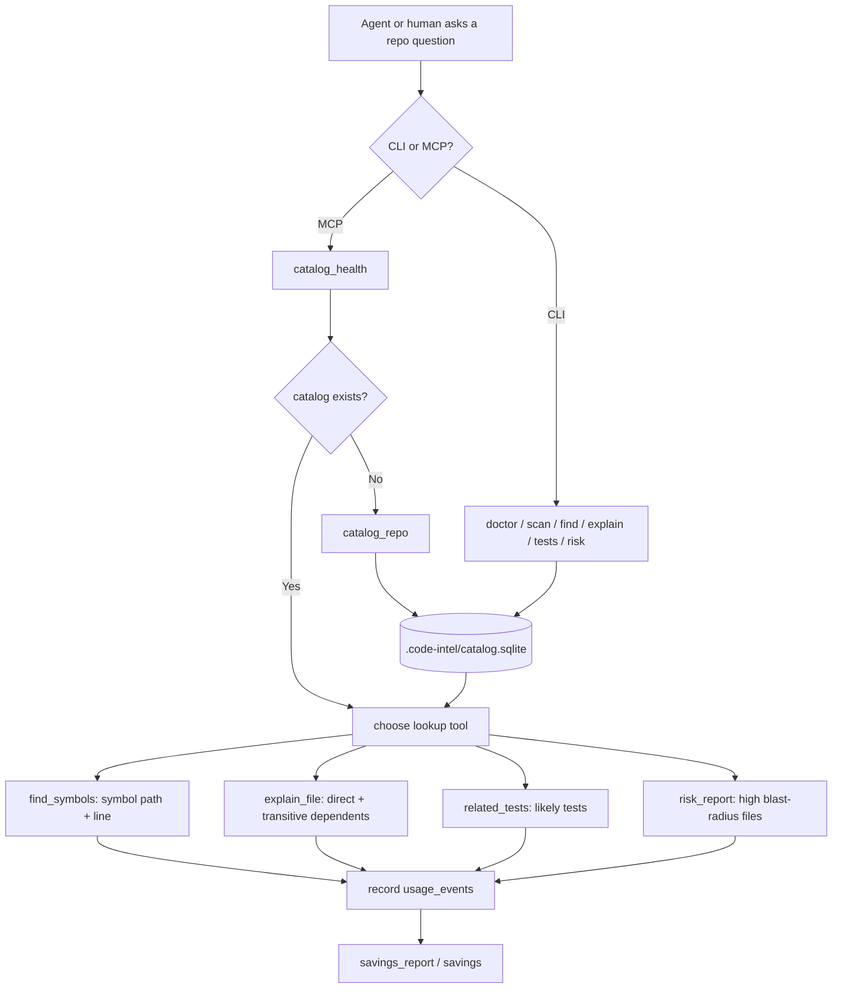

# code-intel

```text
   ______          __        ____      __       __
  / ____/___  ____/ /__     /  _/___  / /____  / /
 / /   / __ \/ __  / _ \    / // __ \/ __/ _ \/ /
/ /___/ /_/ / /_/ /  __/  _/ // / / / /_/  __/ /
\____/\____/\__,_/\___/  /___/_/ /_/\__/\___/_/
```

<p align="center">
  <strong>Self-contained repository intelligence for faster AI-assisted code changes.</strong>
</p>

<p align="center">
  
  
  
  
  
</p>

`code-intel` builds a local SQLite catalog for a repository, then answers the
questions coding agents usually waste time and tokens trying to discover by
scanning files.

It is designed for large codebases where Codex, Claude Code, or a human engineer
needs quick answers before editing:

- where a function, class, method, constant, or type lives
- which files depend on a file
- which tests are likely related to a change
- which files have the highest blast-radius risk
- how much context the targeted lookup likely avoided loading

Normal use is self-contained. `code-intel` creates and reads its own local
catalog at `.code-intel/catalog.sqlite`. It does not require jCodemunch, a hosted
service, or a background daemon.

## Installation

### Run from a source checkout

Use this during development or before publishing the package:

```bash
cd /path/to/code-intel
uv sync --group dev
uv run code-intel --help
```

When operating on another repository from this checkout, pass `--project` so the
command works from any current directory:

```bash
uv run --project /path/to/code-intel code-intel scan /path/to/repo
```

### Install as a local tool

Install the CLI from a local checkout when you want `code-intel` available on
your shell path:

```bash
uv tool install /path/to/code-intel
code-intel --help
```

Reinstall after local changes:

```bash
uv tool install --force /path/to/code-intel
```

### Install MCP support

MCP support is optional:

```bash
cd /path/to/code-intel
uv sync --extra mcp --group dev
```

## Quickstart

Catalog any repository:

```bash
code-intel scan /path/to/repo
```

Search the generated catalog:

```bash
code-intel find --repo /path/to/repo get_database_url
```

Check impact before editing a file:

```bash
code-intel explain --repo /path/to/repo src/app/service.py
code-intel tests --repo /path/to/repo src/app/service.py
code-intel risk --repo /path/to/repo --top 20
```

Show the usage and estimated savings report:

```bash
code-intel savings --repo /path/to/repo
```

## What It Creates

Running `scan` creates this local file inside the target repository:

```text
<repo>/.code-intel/catalog.sqlite
```

The SQLite catalog contains:

| Table | Purpose |
| --- | --- |
| `meta` | repo path, generated time, file count |
| `files` | discovered source files, language, line count, byte size |
| `symbols` | names, kinds, paths, line numbers, signatures, docs |
| `dependencies` | resolved and unresolved import edges |
| `usage_events` | lookup events used for savings reports |

The catalog is generated data. Keep it out of commits.

For a project-local ignore without changing tracked files:

```bash
printf '\n.code-intel/\n' >> /path/to/repo/.git/info/exclude
```

For a shared project ignore:

```bash
echo ".code-intel/" >> /path/to/repo/.gitignore
```

## Commands

### `scan`

Build or refresh the catalog.

```bash
code-intel scan [REPO]
code-intel scan /path/to/repo
```

If the database does not exist, `scan` creates `.code-intel/` and
`catalog.sqlite`. If it already exists, `scan` rebuilds it from the current
source tree.

### `find`

Find cataloged symbols without scanning the whole repo.

```bash
code-intel find --repo /path/to/repo SymbolName
code-intel find --repo /path/to/repo SymbolName --limit 5
```

Default provider is the built-in `catalog` provider. If the catalog is missing,
`find` exits with a clear message telling you to run `scan` first.

Optional compatibility provider:

```bash
code-intel find --repo /path/to/repo SymbolName --provider jcodemunch
```

The `jcodemunch` provider only reads an existing local jCodemunch SQLite
database when explicitly requested. It is not required for normal operation.

### `explain`

Show the likely impact of changing a file.

```bash
code-intel explain --repo /path/to/repo src/app/service.py
code-intel explain --repo /path/to/repo src/app/service.py --json
```

The report includes direct dependents, transitive dependents, related tests, a
blast score, and a risk label.

### `tests`

Find tests likely related to a source file.

```bash
code-intel tests --repo /path/to/repo src/app/service.py
```

Signals include matching file names, imports, and public source symbols
mentioned in test files.

### `risk`

Rank source files by blast-radius risk.

```bash
code-intel risk --repo /path/to/repo --top 20
```

Use this before broad refactors or when deciding where extra test coverage
matters most.

### `savings`

Report lookup usage and estimated avoided context.

```bash
code-intel savings --repo /path/to/repo
code-intel savings --repo /path/to/repo --json
```

The estimate compares the cataloged repository size to the smaller set of files
returned by targeted lookups. It is directional, not billing-grade.

### `doctor`

Inspect repository and catalog health.

```bash
code-intel doctor /path/to/repo
```

Use this when an agent is unsure whether a repo has been scanned.

## Search Flow



The important guardrail is that the built-in catalog provider never silently
falls back to a missing index. If the catalog is absent, `find` tells you to run
`scan`, and the MCP flow should call `catalog_repo`.

## MCP Server

Run the MCP server over stdio:

```bash
code-intel serve-mcp --repo /path/to/repo
```

When running from a source checkout without a global install:

```bash
uv run --project /path/to/code-intel code-intel serve-mcp --repo /path/to/repo
```

Example MCP client config when running from this checkout:

```json
{
  "mcpServers": {
    "code-intel": {
      "command": "uv",
      "args": [
        "run",
        "--project",
        "/path/to/code-intel",
        "code-intel",
        "serve-mcp",
        "--repo",
        "/path/to/repo"
      ]
    }
  }
}
```

MCP tools:

| Tool | Purpose |
| --- | --- |
| `catalog_repo` | build or refresh the catalog |
| `find_symbols` | search symbols from the catalog |
| `explain_file` | explain change impact for one file |
| `related_tests` | return likely test files for one source file |
| `risk_report` | list highest-risk files |
| `catalog_health` | report catalog status and counts |
| `savings_report` | report usage and estimated savings |

Recommended agent behavior:

1. Call `catalog_health`.
2. If `catalog_exists` is false, call `catalog_repo`.
3. Use `find_symbols`, `explain_file`, `related_tests`, and `risk_report`
   before loading broad file context.
4. Use `savings_report` when you want evidence that the tool reduced context.

## Agent Notes

`code-intel` can upsert a small managed instruction block into `CLAUDE.md` and
`AGENTS.md` so Claude Code and Codex know how to use it.

From this checkout:

```bash
uv run code-intel install-agent-notes /path/to/repo \
  --command-prefix "uv run --project /path/to/code-intel code-intel"
```

The generated section is bounded by comment markers, so re-running the command
updates the same block instead of appending duplicates.

## Replacing jCodemunch Day-to-Day

`code-intel` is intended to replace the common jCodemunch workflow used by
coding agents: orient to a repo, find symbols, understand file impact, choose
tests, and report saved context. It is not yet a drop-in replacement for every
jCodemunch feature such as semantic embeddings, watcher hooks, AI summaries, or
hosted Q&A.

| Day-to-day need | code-intel replacement |
| --- | --- |
| Create or refresh repo knowledge | `scan` or MCP `catalog_repo` |
| Check whether repo knowledge exists | `doctor` or MCP `catalog_health` |
| Find symbols | `find` or MCP `find_symbols` |
| Explain impact before edits | `explain` or MCP `explain_file` |
| Pick likely tests | `tests` or MCP `related_tests` |
| Find risky files | `risk` or MCP `risk_report` |
| Show value after use | `savings` or MCP `savings_report` |
| Migrate from existing jCodemunch data | explicit `--provider jcodemunch` |

Default behavior stays independent. The `jcodemunch` provider is only a bridge
for migration or comparison when a local jCodemunch SQLite database already
exists.

## AI Workflow Comparison

| Task | Without code-intel | With code-intel |
| --- | --- | --- |
| Find a symbol | grep or scan many files | one symbol lookup with path and line |
| Understand change impact | manually trace imports | `explain` or `explain_file` |
| Pick tests | guess from file names | `tests` or `related_tests` |
| Find risky files | broad manual inspection | `risk` or `risk_report` |
| Measure value | anecdotal | `savings` or `savings_report` |

## Validation Snapshot

Sample local validation on a medium Python repository. Timings are from one
machine and should be treated as directional, not benchmarks.

| Check | Result |
| --- | --- |
| Test suite | `19 passed` |
| Initial scan | 516 files, 8,353 symbols, 3,979 dependencies in 1.49s |
| Catalog lookup | exact symbol path and line in 0.09s |
| `git grep` comparison | raw text matches in 0.02s, including call sites |
| jCodemunch compatibility provider | same symbol found in 0.16s when an existing jCodemunch DB was present |
| Missing catalog guard | `find` exits with "Run `code-intel scan` first" and creates no partial DB |
| Risk report | returns direct dependents, transitive dependents, test counts, and risk labels |
| Savings estimate | one catalog lookup estimated about 2.0M avoided context tokens on the sample repo |

The comparison is intentionally conservative: grep can be faster for a single
text query, but it returns text matches rather than structured symbol records,
dependency impact, likely tests, risk ranking, and savings telemetry. The value
for agents is less broad context loading and more targeted next actions.

## Supported Source Types

Current built-in analyzers:

| Language | Extensions | Symbol extraction | Dependency extraction |
| --- | --- | --- | --- |
| Python | `.py` | AST-based functions, classes, methods | AST imports and relative imports |
| JavaScript | `.js`, `.mjs`, `.cjs`, `.jsx` | conservative regex functions, classes, constants, types | import, export-from, require, dynamic import |
| TypeScript | `.ts`, `.tsx` | conservative regex functions, classes, constants, types | import, export-from, require, dynamic import |

The analyzer set is intentionally conservative. Add new languages as focused
providers instead of making the core scanner guess.

## Development

```bash
uv sync --group dev
uv run pytest
uv run ruff check .
uv run ruff format --check .
```

Useful local smoke test:

```bash
uv run code-intel scan .
uv run code-intel find --repo . CatalogStore --limit 3
uv run code-intel savings --repo .
```

## Design Principles

- Stay self-contained by default.
- Keep generated catalogs out of commits.
- Prefer structured parsers where available.
- Keep agent instructions concise and managed.
- Make optional compatibility providers explicit.
- Favor targeted context over broad file loading.
